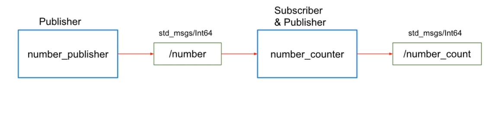

# Number Publisher and Subscriber

## Objectives

Create two nodes with the following features.

- The first node number publisher will publish to a topic named `/number` with the message type, standard message int 64.

- The second node is a number counter containing a subscriber and a publisher. Every time it receives a number, it will add it to a counter, and every time it receives a number and increases the counter, it will also publish on the topic `/number_count` with standard message int 64. (You can write in Python/C++)



## Creating a package

- Source the workspace

```bash
source ~/catkin_ws/devel/setup.bash
```

- Create a package

```bash
cd ~/catkin_ws/src
catkin_create_pkg exercises std_msgs rospy
```

This will create a package named `exercises` with dependencies on `std_msgs` and `rospy`.

## Create the publisher node

- Create a file named number_publisher.py in the `src` folder of the `exercises` package.

```bash
cd ~/catkin_ws/src/exercises/src
touch number_publisher.py
```

- Open the file and add the following code:

```python
#!/usr/bin/env python
import rospy
from std_msgs.msg import Int64

def publisher():
    rospy.init_node('number_publisher', anonymous=True)
    number_publisher = rospy.Publisher('/number', Int64, queue_size=10)

    msg = Int64()
    rate = rospy.Rate(1)
    msg.data = 1

    while not rospy.is_shutdown():
        number_publisher.publish(msg)
        print("Published number: ", msg.data)
        rate.sleep()

if __name__ == '__main__':
    try:
        publisher()
    except rospy.ROSInterruptException:
        pass

```

## Create the subscriber node

- Create a file named number_counter.py in the `src` folder of the `exercises` package.

```bash
cd ~/catkin_ws/src/exercises/src
touch number_counter.py
```

- Open the file and add the following code:

```python
#!/usr/bin/env python
import rospy
from std_msgs.msg import Int64

TOTAL = 0

def callback(data, counter_publisher):
    global TOTAL
    TOTAL += data.data
    msg = Int64()
    msg.data = TOTAL
    counter_publisher.publish(msg)
    print("Total count: ", msg.data)

def listener():
    rospy.init_node('number_counter', anonymous=True)
    counter_publisher = rospy.Publisher('/number_count', Int64, queue_size=10)
    rospy.Subscriber("/number", Int64, callback,counter_publisher)
    rospy.spin()

if __name__ == '__main__':
    listener()
```

## Make the scripts executable

```bash
cd ~/catkin_ws/src/exercises/src
chmod u+x number_publisher.py
chmod u+x number_counter.py
```

## Build the package

```bash
cd ~/catkin_ws
catkin_make
```

## Run the nodes

- Open a terminal and run the roscore:

```bash
roscore
```

- Open a new terminal and run the number publisher node:

```bash
source ~/catkin_ws/devel/setup.bash
rosrun exercises number_publisher.py
```

- Open a new terminal and run the number counter node:

```bash
source ~/catkin_ws/devel/setup.bash
rosrun exercises number_counter.py
```
