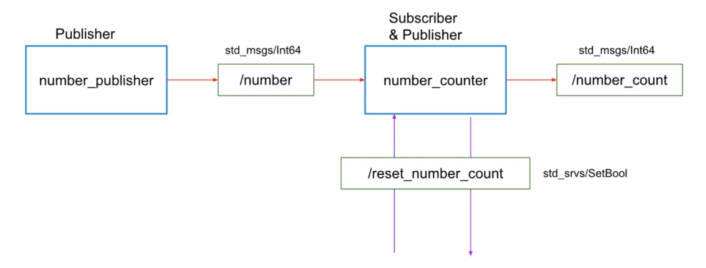

# Reset Service

## Objectives

In the previous exercise, the number counter was subscribed to this topic. The node counter would add the number inside the message into an internal counter for every message received. It would publish the counter's value each time on a number count topic. Well, it would be great to ask the number count node to reset the counter at any time. Here, this is the exercise, where, inside the number_counter node, you will create a service server withe the service type: standard service set boolean.



## Add the service server to the number_counter node

- Open the file number_counter.py and change to the following code:

```python
#!/usr/bin/env python
import rospy
from std_msgs.msg import Int64
from std_srvs.srv import SetBool

TOTAL = 0

def handle_reset(req):
    global TOTAL
    TOTAL = 0
    print("Total count reset to 0")
    return True, "Total count reset to 0"

def callback(data, counter_publisher):
    global TOTAL
    TOTAL += data.data
    msg = Int64()
    msg.data = TOTAL
    counter_publisher.publish(msg)
    print("Total count: ", msg.data)

def listener():
    rospy.init_node('number_counter', anonymous=True)
    counter_publisher = rospy.Publisher('/number_count', Int64, queue_size=10)
    rospy.Service('reset_number_count', SetBool, handle_reset)
    rospy.Subscriber("/number", Int64, callback,counter_publisher)
    rospy.spin()

if __name__ == '__main__':
    listener()
```

## Call the service

- Open a new terminal and call the service:

```bash
rosservice call /reset_number_count True
```

- You should see the message "Total count reset to 0" in the terminal where the number_counter node is running. The counter will be reset to 0.
